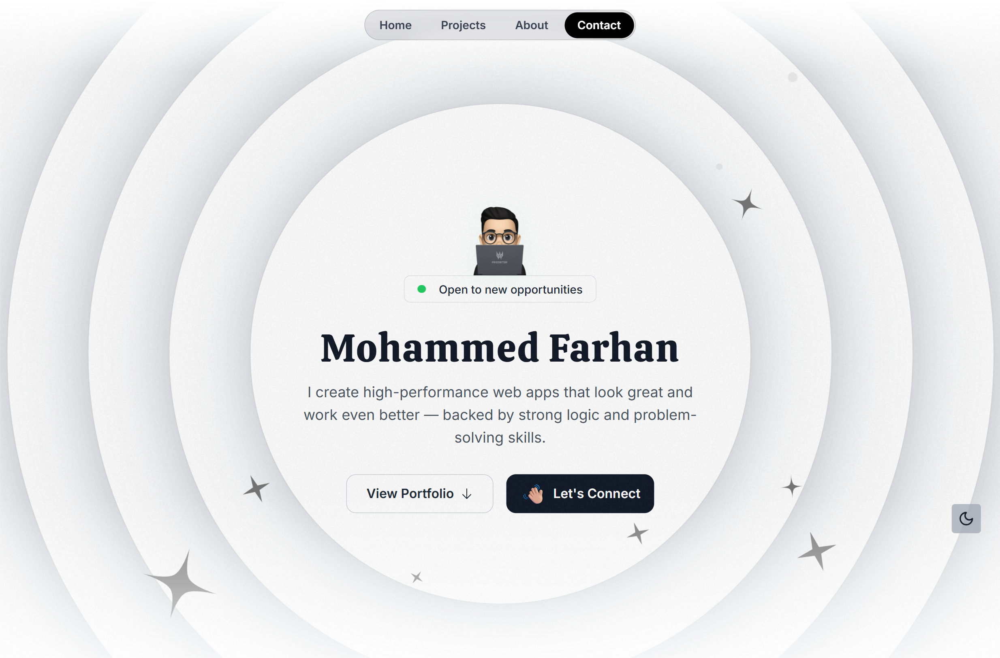

# 🧑‍💻 Mohammed Farhan – My Portfolio

A clean and modern developer portfolio built with **Next.js 14**, **Tailwind CSS**, and **Framer Motion**. Fully responsive, fast, and optimized to showcase your work, skills, and online presence.

## 🔗 **Live Demo:** [Click Here](https://mohammedfarhan.vercel.app)

## 🚀 Tech Stack

- **Framework:** [Next.js 14](https://nextjs.org/)
- **Styling:** [Tailwind CSS 3.4](https://tailwindcss.com/)
- **Animation:** [Framer Motion](https://www.framer.com/motion/)
- **Icons:** [Lucide React](https://lucide.dev/)
- **Utilities:** `tailwind-merge`, `SVGR`, TypeScript

---

## 📸 Preview

---

## 📸 Features

- ✨ Minimal and accessible UI  
- 🎨 Responsive layout for all devices  
- 🚀 Fast performance with optimized builds  
- 🔗 Hero, Projects, About, Testimonials & Contact sections  
- 🌓 Clean dark/light theme support  
- ⚡ Smooth page transitions  

---

Built with ❤️ by [Mohammed Farhan](https://github.com/TheRealFarhanDev)
